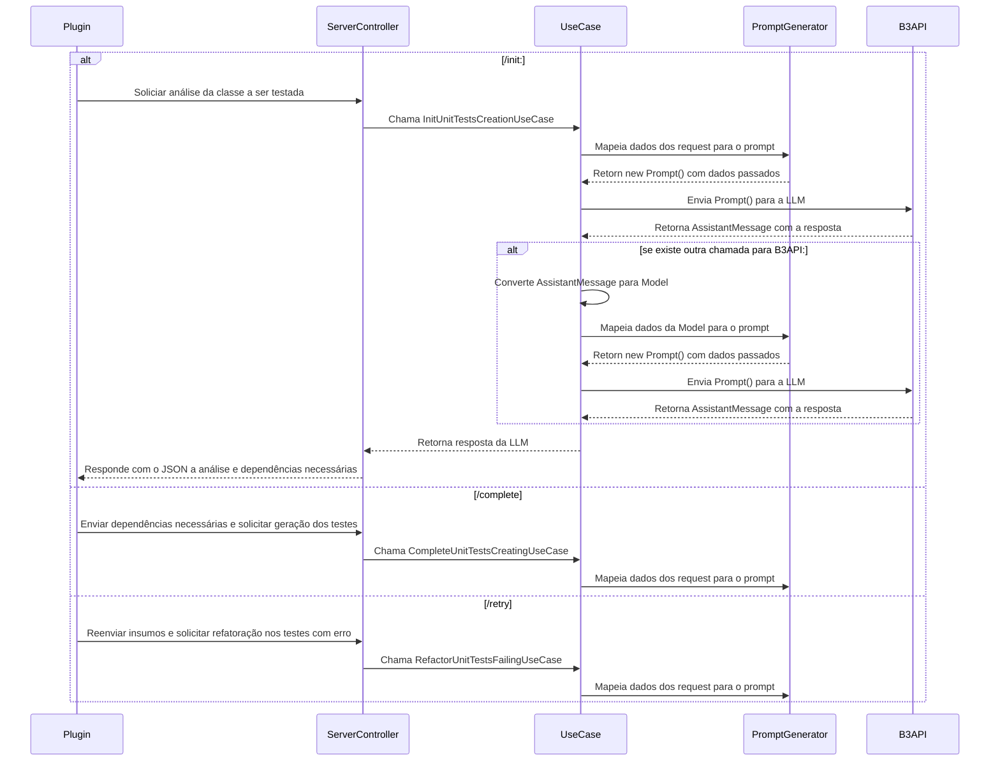

# 😺 UniCat 
## Geração de testes unitários em menos de 5 minutos

### Demonstração

### Fluxo de funcionamento

```mermaid
sequenceDiagram
    participant Plugin
    participant ServerController
    participant UseCase
    participant PromptGenerator
    participant B3API

    alt /init:
        Plugin->>ServerController: Soliciar análise da classe a ser testada
        
        ServerController->>UseCase: Chama InitUnitTestsCreationUseCase
        UseCase->>PromptGenerator: Mapeia dados dos request para o prompt
        PromptGenerator-->>UseCase: Retorn new Prompt() com dados passados
        UseCase->>B3API: Envia Prompt() para a LLM
        B3API-->>UseCase: Retorna AssistantMessage com a resposta
        
        alt se existe outra chamada para B3API:
            UseCase->>UseCase: Converte AssistantMessage para Model
            UseCase->>PromptGenerator: Mapeia dados da Model para o prompt
            PromptGenerator-->>UseCase: Retorn new Prompt() com dados passados
            UseCase->>B3API: Envia Prompt() para a LLM
            B3API-->>UseCase: Retorna AssistantMessage com a resposta
        end

        UseCase-->>ServerController: Retorna resposta da LLM
        ServerController-->>Plugin: Responde com o JSON a análise e dependências necessárias

    else /complete
        Plugin->>ServerController: Enviar dependências necessárias e solicitar geração dos testes

        ServerController->>UseCase: Chama CompleteUnitTestsCreatingUseCase
        UseCase->>PromptGenerator: Mapeia dados dos request para o prompt

    else /retry
        Plugin->>ServerController: Reenviar insumos e solicitar refatoração nos testes com erro

        ServerController->>UseCase: Chama RefactorUnitTestsFailingUseCase
        UseCase->>PromptGenerator: Mapeia dados dos request para o prompt

    end
```
