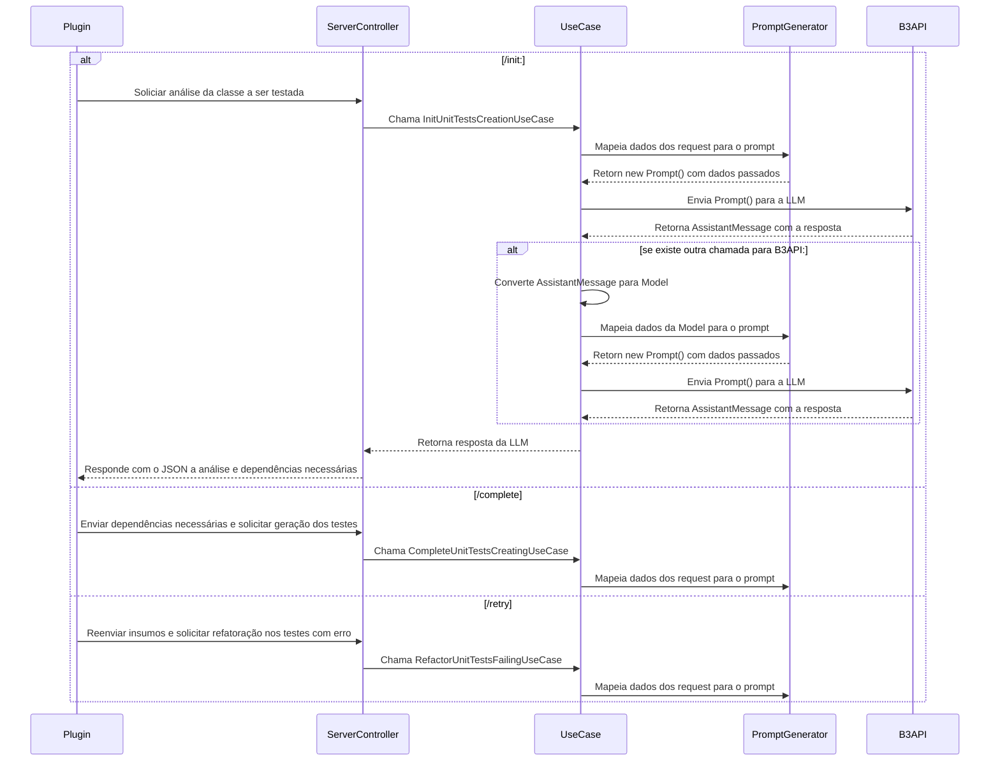

# 😺 UniCat 
## Geração de testes unitários em menos de 5 minutos
Já pensou em gerar uma classe de testes unitários inteira em menos de 5 minutos? Com o UniCat você pode!
O UniCat é um plugin para a IDE IntelliJ IDEA direcionado para a geração de testes unitários. Com o auxílio da Inteligência Artificial, o plugin automatiza a criação dos testes seguindo as melhores práticas de código.
Basta selecionar uma classe Java, ativar o plugin e esperar enquanto UniCat traz o poder da IA para os seus testes! 

Este projeto foi desenvolvido para a Hackathon 2025 da B3.

### Demonstração
Parece bom demais pra ser verdade? Assista abaixo a demonstração do nosso protótipo e veja o UniCat em ação!

https://github.com/user-attachments/assets/549d4ff1-2ee4-4229-b358-d641a4635aeb

### Detalhes técnicos

A estrutura do UniCat é composta pelos seguintes elementos: 
- Plugin para o IntelliJ IDEA escrito em Kotlin; 
- Back end Java Spring que utiliza a mais recente ferramenta do framework: Spring AI;
- API do modelo GPT-4o da AzureOpenAI. 

O plugin é responsável por enviar ao Back End a classe a ser testada e todas as dependências necessárias para a geração de bons testes. O Back End, por sua vez, associa o código a prompts especialmente desenvolvidos para este fim, enviando à IA os insumos requisitados para a escrita do código. 
O código escrito é enviado novamente ao plugin, que já executa os testes fornecidos, solicitando ao Back End a refatoração dos testes falhos.

### Fluxo de funcionamento

