```mermaid
sequenceDiagram
    participant Plugin
    participant ServerController
    participant UseCase
    participant PromptGenerator
    participant B3API

    alt /init:
        Plugin->>ServerController: Soliciar análise da classe a ser testada
        
        ServerController->>UseCase: Chama InitUnitTestsCreationUseCase
        UseCase->>PromptGenerator: Mapeia dados dos request para o prompt
        PromptGenerator-->>UseCase: Retorn new Prompt() com dados passados
        UseCase->>B3API: Envia Prompt() para a LLM
        B3API-->>UseCase: Retorna AssistantMessage com a resposta
        
        alt se existe outra chamada para B3API:
            UseCase->>UseCase: Converte AssistantMessage para Model
            UseCase->>PromptGenerator: Mapeia dados da Model para o prompt
            PromptGenerator-->>UseCase: Retorn new Prompt() com dados passados
            UseCase->>B3API: Envia Prompt() para a LLM
            B3API-->>UseCase: Retorna AssistantMessage com a resposta
        end

        UseCase-->>ServerController: Retorna resposta da LLM
        ServerController-->>Plugin: Responde com o JSON a análise e dependências necessárias

    else /complete
        Plugin->>ServerController: Enviar dependências necessárias e solicitar geração dos testes

        ServerController->>UseCase: Chama CompleteUnitTestsCreatingUseCase
        UseCase->>PromptGenerator: Mapeia dados dos request para o prompt

    else /retry
        Plugin->>ServerController: Reenviar insumos e solicitar refatoração nos testes com erro

        ServerController->>UseCase: Chama RefactorUnitTestsFailingUseCase
        UseCase->>PromptGenerator: Mapeia dados dos request para o prompt

    end
```

# 😺 UniCat 
## 🕐 Geração de testes unitários em menos de 5 minutos
Já pensou em gerar uma classe de testes unitários inteira em menos de 5 minutos? Com o UniCat você pode!

O UniCat é um plugin para a IDE IntelliJ IDEA direcionado para a geração de testes unitários. Com o auxílio da Inteligência Artificial, o plugin automatiza a criação dos testes seguindo as melhores práticas de código.
Basta selecionar uma classe Java, ativar o plugin e esperar enquanto UniCat traz o poder da IA para os seus testes! 

    

Este projeto foi desenvolvido para a Hackathon 2025 da B3.

## 💻 Demonstração
Parece bom demais pra ser verdade? Assista abaixo a demonstração do nosso protótipo e veja o UniCat em ação!

https://github.com/user-attachments/assets/549d4ff1-2ee4-4229-b358-d641a4635aeb

## 🔧 Detalhes técnicos

    

A estrutura do UniCat é composta pelos seguintes elementos: 
- Plugin para o IntelliJ IDEA escrito em Kotlin; 
- Back end Java Spring que utiliza a mais recente ferramenta do framework: Spring AI;
- API do modelo GPT-4o da AzureOpenAI. 

O plugin é responsável por enviar ao Back End a classe a ser testada e todas as dependências necessárias para a geração de bons testes. O Back End, por sua vez, associa o código a prompts especialmente desenvolvidos para este fim, enviando à IA os insumos requisitados para a escrita do código. 

O código escrito é enviado novamente ao plugin, que já executa os testes fornecidos, solicitando ao Back End a refatoração dos testes falhos.

## 🔄 Fluxo de funcionamento

